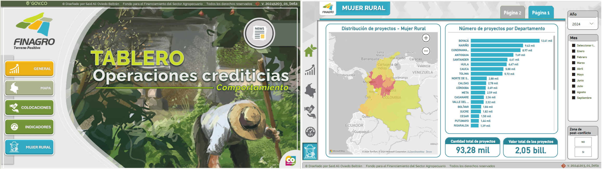
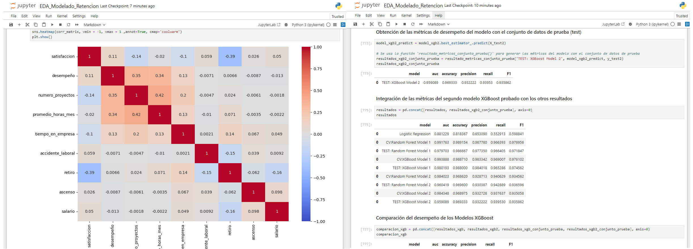
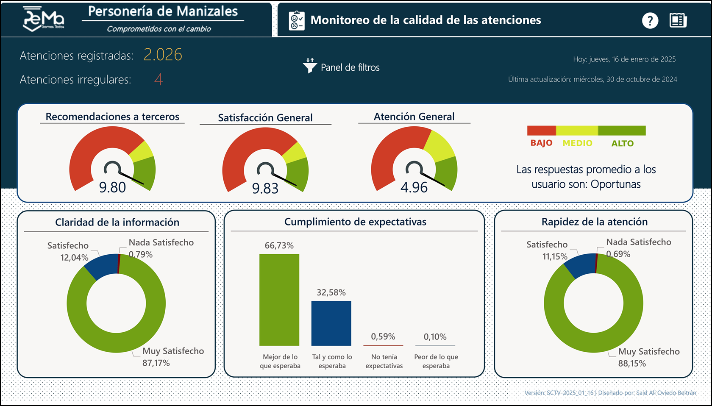
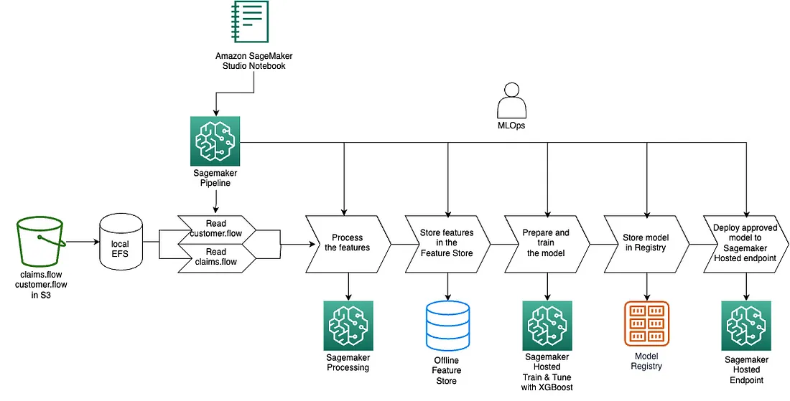
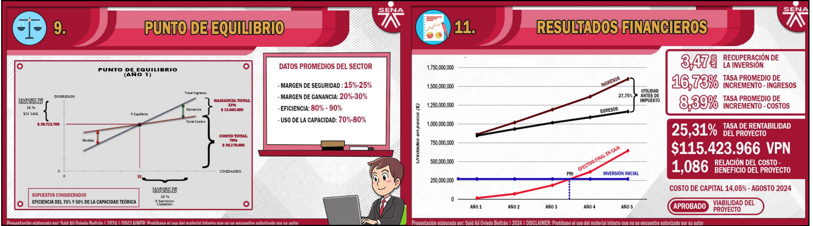
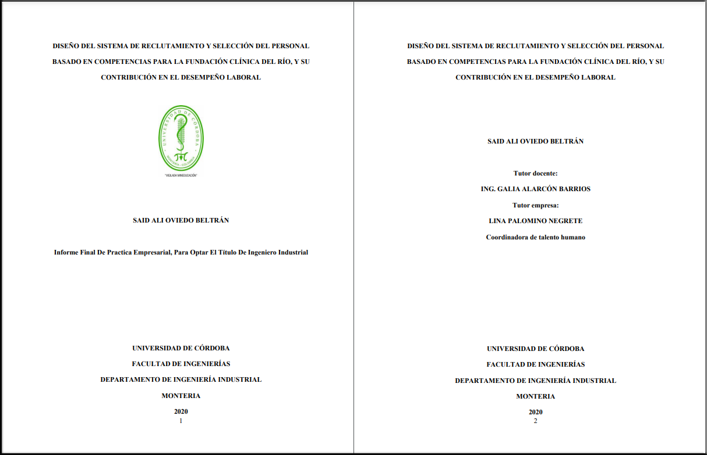

# ¡Hola! Bienvenido a mi Portafolio
Aquí encontrarás una selección de algunos de mis proyectos analíticos y de ingeniería más destacados.

### Áreas
#### `AD: Análisis de datos` | `CD: Ciencia de datos` | `EM: Empresa` | `BI: Inteligencia de negocios`

## Sobre mí
Soy un apasionado de la ciencia de datos, la Inteligencia de Negocios , las Finanzas Corporativas y los Sistemas Informáticos. Cuento con experiencia desarrollando proyectos de análisis y visualización de datos, modelado dimensional, modelado analítico, ingeniería de de datos y construcción de KPIs. Mi objetivo siempre, es convertir datos crudos en información valiosa para la toma de decisiones estratégica siguiendo "frameworks" de trabajo como CRISP-DM y SCRUM.

## Mis Proyectos Destacados
### [AD-BI] [Datos para la inclusión: Análisis de las dinámicas crediticias de FINAGRO (2021-2024) en la inclusión financiera, diversificación agropecuaria y equidad de género en zonas rurales y de posconflicto en Colombia](https://github.com/saob007/Data-Analysis---Agrocr-ditos-FINAGRO-2023)
- **Resumen:** Análisis exploratorio de datos y visualización de insights y KPIs basado en el historial de operaciones crediticias del Fondo para el Financiamiento del Sector Agropecuario (FINAGRO) entre enero de 2021 y septiembre de 2024. El estudio se centra en evaluar el impacto de los créditos colocados en tres dimensiones clave: inclusión financiera, diversificación agropecuaria y equidad de género.
- **Áreas de trabajo:** Análisis exploratorio de datos (EDA) , modelado dimensional, creación de tablero interactivo, contrucción de KPIs e inteligencia de negocios.
- **Herramientas:** Jupyter Notebook, Python, R, Power BI, Pandas, Numpy, Matplotlib, Seaborn, DAX.
- **Resultados:** Identificación y medición de la cobertura de créditos en tres dimensiones de estudio.

    

**Consulta los resultados del proyecto según tu interés sin tener que descargar ningún archivo:**

### [AD-CD] [Análisis exploratorio y contrucción de un modelo predictivo de deserción del talento humano, para una empresa de desarrollo de tecnología automotriz](https://github.com/saob007/Modelado_retencion_personal_proyecto)
- **Resumen:** Desarrollo de modelos predictivos mediante regresión logística, bosque aleatorio (Random Forest) y árboles de decisión potenciados por gradientes (XGBoost) para predecir desvinculación de empleados en una empresa del sector industrial. El objetivo es identificar el modelo con mejor rendimiento, proporcionando a los stakeholders una herramienta para predecir riesgos de deserción y optimizar la retención del talento humano.
- **Áreas de trabajo:** Análisis exploratorio de datos (EDA), análisis estadístico, modelación analítica para problemas de clasificación e inteligencia de negocios.
- **Herramientas:** Logistic Regression, Random Forest Algorithm, XGBoost Algorithm, scikit-learn , Anaconda, JupyterLab, Python, Pyplot, seaborn, statsmodel.
- **Resultados:** Modelo predictivo de deserción del talento humano, Análisis estadístico de los factores causales de retención del talento humano.

    

**Consulta los resultados del proyecto según tu interés sin tener que descargar ningún archivo:**

### [BI] [Diseño de un tablero interáctivo para el monitoreo de la calidad del proceso de atención ejecutado por la Personería de Manizales](https://github.com/saob007/Tablero_monitoreo_calidad_atenciones)
- **Resumen:** Diseño e implementación de un tablero de control interactivo en Power BI Service para el seguimiento y análisis de métricas del proceso de atención al usuario en la Personería de Manizales. Este tablero servirá como una herramienta clave para monitorear la calidad del servicio, facilitando la extracción visual de insights, apoyando la toma de decisiones estratégicas.
- **Áreas de trabajo:** Creación de productos dinámicos para la visualización de datos (tablero interáctivo).
- **Herramientas:** Power BI, Power Point, SODA Frameworks Project, AZURE DB.
- **Resultados:** Tablero interactivo único para el seguimiento de indicadores y mediciones del área de atención al cliente.

    

**Consulta los resultados del proyecto según tu interés sin tener que descargar ningún archivo:**

### [AD-CD] [***En proceso:*** Análisis de Datos para el Control y la Prevención del Fraude y el Lavado de Dinero en los Servicios Financieros de Amazon]
- **Resumen:** Proceso EDA y construcción de un modelo predictivo para el reconocimiento de transacciones fraudulentas categorizadas como riesgosas por el Sistema de Autocontrol y Gestión del Riesgo Integral de Lavado de Activos, Financiación del Terrorismo y Financiamiento de la Proliferación de Armas de Destrucción Masiva (SAGRILAFT).
- **Descripción:** Análisis exploratorio de datos (EDA), modelación analítica para problemas de clasificación e inteligencia de negocios.
- **Herramientas:** Python, Jupyter Lab as IDE, R Studio, Pyplot.
- **Resultados:** Modelo estadístico para la implementación de "Machine Learning" .

    

**Aún no se publican los resultados (Status = inProgress)**

### [EM] [Formulación de un plan de negocio para la creación de una agencia especializada en la gestión y cobranza de carteras de deuda, direccionada a PYMES de la ciudad de Montería](https://github.com/saob007/Plan_negocios_empresa_cobranza)
- **Resumen:** Plan estratégico de negocio para SOLUCIONES DE COBRANZA S.A.S. (SODECO), una empresa regional especializada en la gestión de carteras de crédito para PYMES y que busca posicionarse como un aliado estratégico, ofreciendo soluciones que reduzcan la morosidad y mejoren la liquidez empresarial. Todo esto con base en un análisis del mercado local y proyecciones financieras realistas, garantizando estrategias alineadas con las necesidades de los clientes y los objetivos comerciales.
- **Áreas de trabajo:** Credito y cobranza, administración de la liquidez, gestión de proyectos, estudios de operabilidad.
- **Herramientas:** Microsoft Excel, Microsoft Word, Gantter para la gestión de proyectos, Google Workspace, Microsoft Forms.
- **Resultados:** Plan integral estratégico para la puesta en marcha de una unidad productiva de negocio .

    

**Consulta los resultados del proyecto según tu interés sin tener que descargar ningún archivo:**

### [EM] [Diseño del sistema de reclutamiento y selección del personal basado en competencias para la fundación clínica del río, y su contribución en el desempeño laboral](https://repositorio.unicordoba.edu.co/handle/ucordoba/3895)
- **Resumen:** Reconstrucción detallada del proceso de diseño de un sistema de reclutamiento y selección de personal del área asistencial y administrativa, basado en competencias para una entidad del sector salud.
- **Áreas de trabajo:** Ingeniería de procesos, levantamiento documental y planeación del trabajo.
- **Herramientas:** Microsoft Excel, Microsoft Word, Dynamica SAP, Canvas.
- **Resultados:** Formatos y manuales de métodos & procedimientos .

    

**Consulta los resultados del proyecto según tu interés sin tener que descargar ningún archivo:**

## Habilidades
- **Lenguajes de Programación:** SQL, Python, R, Visual Basic, DAX(consultas).
- **Herramientas de Visualización:** Power BI, Tableau, Excel , Matplotlib, Seaborn, Plotly.
- **Paquetes de Python:** Pandas, Numpy, Scipy, Statsmodel, Scikit-learn, Pickle, Tensorflow.
- **Modelos de "Machine Learning":** Regression (linear,logistic), Naive-Bayes, Decision trees, Random Forest, AdaBoost, XGBoost.
- **Otras Herramientas Estadísticas:** A/B Testing, Probability distribution, Sampling, Hypothesis testing, ANOVA, ANCOVA, MANOVA, MANCOVA.
- **Otras Herramientas especializadas:** Microsoft Office 365, Jupyter Lab, Anaconda, SAP, Adobe Photoshop, Spider.

## Contacto
- **Email:** [ingsaidalioviedo@gmail.com](mailto:ingsaidalioviedo@gmail.com)
- **LinkedIn:** [Mi Perfil](https://www.linkedin.com/in/saidalioviedo/)
- **GitHub:** [Mi GitHub](https://github.com/saob007)

---
